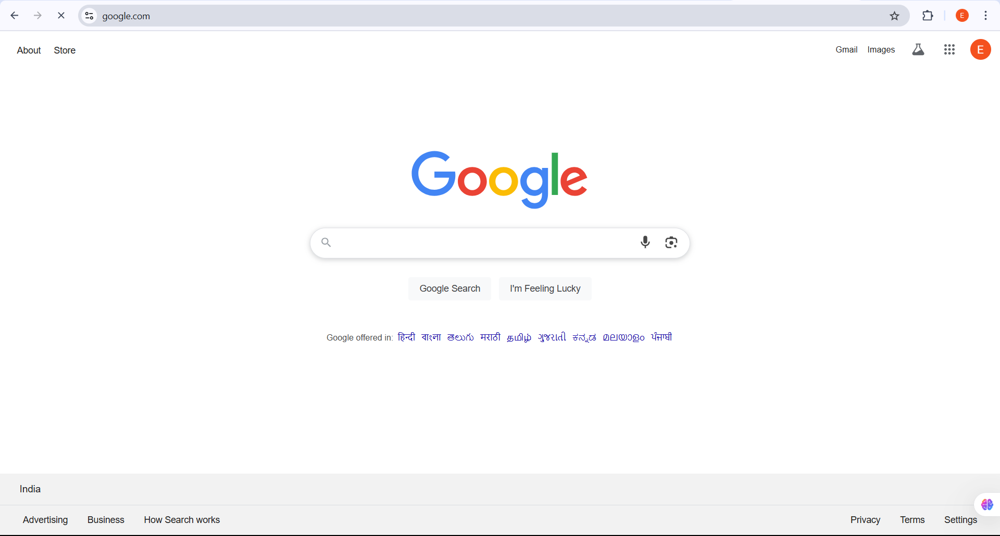

# URL Shortener - MERN Stack Production-Ready Project

A full-featured, production-level URL shortener built with the **MERN stack** (MongoDB, Express.js, React.js, Node.js). This project demonstrates backend API design, frontend integration, authentication, state management, and deployment best practices.

## Project Overview

This project is a URL shortening service similar to Bit.ly or TinyURL. It allows users to convert long URLs into short, easily shareable links. The app supports:

- Creating short URLs with custom aliases
- User authentication and persistent login
- Client-side routing for smooth navigation
- State management with Redux
- Scalable backend architecture with modular Express routes
- Deployment-ready frontend and backend configuration

---

## Features

- Generate short URLs from long URLs
- User registration and login (JWT-based)
- Persistent authentication across sessions
- Custom URL aliases (optional)
- Dashboard to manage URLs
- Modular backend code for scalability
- React frontend with TanStack Query for data fetching
- Redux for global state management
- Responsive UI and client-side routing

---

## Tech Stack

**Frontend:** React.js, React Router, Redux, TanStack Query  
**Backend:** Node.js, Express.js  
**Database:** MongoDB (with Mongoose ORM)  
**Authentication:** JWT (JSON Web Tokens)  
**Deployment:** Production-ready configurations included

---

## Screenshots

### 1. Create Account Page

### 2. Custom URL Creation

### 3. Short URL Creation

### 4. Dashboard

### 5. Login Page

### 6. Opening Page

### 7. Redirecting URL

### 8. Shortened URL Example

### 9. User Login Page

### 10. Using Shortened URL

